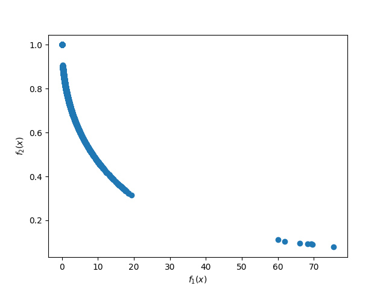

# moead-prolog
MOEA/D, multi-objective evolutionary algorithm implemented in prolog.

MOEA/D was presented by Zhang et al in 2007. The citation can be seen at the bottom of this document.


This repo contains an implementation of the MOEA/D evolutionary algorithm implemented in prolog. You can use this repo to solve multi-objective problems (MOP).

The power of prolog comes from it's declarative nature. This allows the user to define an MOP and solve said problem with a few lines of code.

### Example

```prolog
:- [moead].

objective(1, [X1,X2], O):-
    O is 100 * (X1**2 + X2**2).

objective(2, [X1,X2], O):-
    O is (X1-1)**2 + X2**2.

varaiable_ranges([[-2.0, 2.0], [-2.0, 2.0]]).

n_obj(2).
% Population Size:
population_size(15).

weight_vectors([[0, 1], [1r14, 13r14], [1r7, 6r7], [3r14, 11r14], [2r7, 5r7], [5r14, 9r14], [3r7, 4r7], [1r2, 1r2], [4r7, 3r7], [9r14, 5r14], [5r7, 2r7], [11r14, 3r14], [6r7, 1r7], [13r14, 1r14], [1, 0]]).
% T, neighbourhood size
neighbourhood_size(2).
```
You can then run the algorithm to solve via:
```prolog
?- moead(230, EP, X, Y).
% 230 being the number of generations/the termination condition.
EP = 'Pareto front approximation'
X  = 'Final population'
Y  = 'Function values of the final population'
```
```EP``` can be plotted to produce:
 

More testing required.
### Weight vectors
As defined in the paper, the weight vectors must be defined before optimisation, they are used as an input. This is to allow greater control over the optimisation process. 

If you do not have a method of defining your own weight vectors, a method is provided. A predicate defining the relation between a number (number of weight vectors) and a nested list of uniform weight vectors is found in ```utils.pl```. This can be used to generate weight vectors via:
```prolog
?- weight_vectors_of_size(5,V).
V = [[0, 1], [1r4, 3r4], [1r2, 1r2], [3r4, 1r4], [1, 0]] 
```

### MUST READ
The number of weight vectors **must be the same** as the population size, otherwise the optimisation fails. This is a requirement of the algorithm definition.

### Citations
Q. Zhang and H. Li, "MOEA/D: A Multiobjective Evolutionary Algorithm Based on Decomposition," in IEEE Transactions on Evolutionary Computation, vol. 11, no. 6, pp. 712-731, Dec. 2007, doi: 10.1109/TEVC.2007.892759.